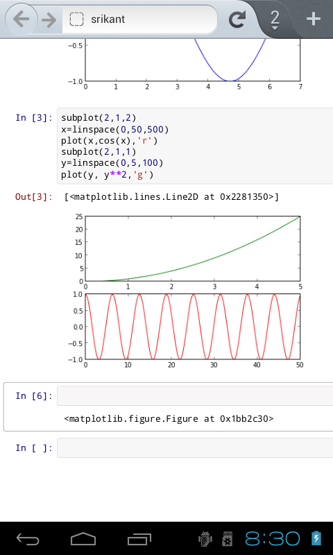

======
README
======

About
-----

This is an application to view ipython notebook on Aakash tablet/Android ICS. This app
is based on `installer <https://github.com/androportal/installer/tree/ics>`_ repository,
on aakash tablet this will come preinstalled. ``Installer`` has a chroot image for 
APL(Aakash Programming Lab) application.

The apk when installed will show the ipython dashboard on localhost in a webview, when a notebook 
is selected it will redirect user to external web browser(firefox & chrome only as they support websockets).

How to use
----------

clone the repository 

::

   git clone https://github.com/androportal/apk-ipython.git

Working with project using `eclipse <http://www.eclipse.org/>`_
---------------------------------------------------------------

After you clone, open ``eclipse`` and goto ``file`` -> ``import`` -> ``Android``
-> ``Existing Android Code into Workspace``, click `Next` and browse the repository.
click `OK` and `Finish`.

